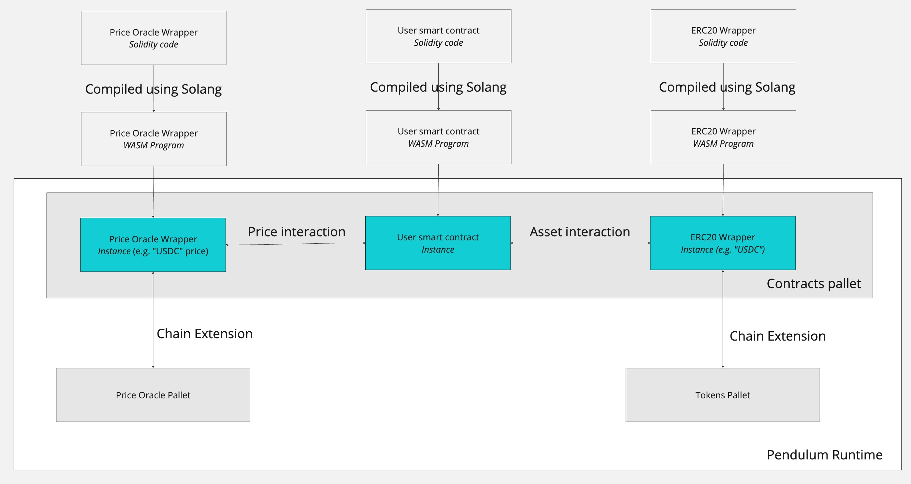

# Overview

## Functional Requirements

### Roles

- User (Contract Caller) - This is a user or a smart contract that expects to interact with a contract that implements
  the ERC-20 interface.

### Features:

Use smart contracts to:

- query the chain (e.g. access balances)
- modify the state of the chain (e.g. transfer assets)
- No changes to smart contract implementation required

### Use Case:

- Without the need to change the implementation, the solidity smart contract can use the on-chain assets, stored in
  pallets, by interacting with the wrapper contract.

## Technical requirements

This project is about enabling the interaction between smart contracts and on-chain asset data.
Using the Solang compiler, we can compile Solidity smart contracts to a WASM binaries, which can then be deployed on the
Contracts pallet.
The on-chain asset data is exposed by so-called chain extensions which facilitate the interaction between the smart
contract and the pallets.
Solang integrates special functions that can be used to interact with the chain extensions.

This project offers two wrapper contract: 1) a wrapper contract for the ERC-20 interface and 2) a wrapper contract for
the `IPriceOracleGetter` interface, used by Chainlink price oracles.
The relevant data is not stored in the wrapper contracts itself.
They only implement the interface of the wrapped contract and forward the calls to the chain extension.

### Architecture Overview

### Contract Information

#### ERC-20 Wrapper

#### Price Oracle Wrapper